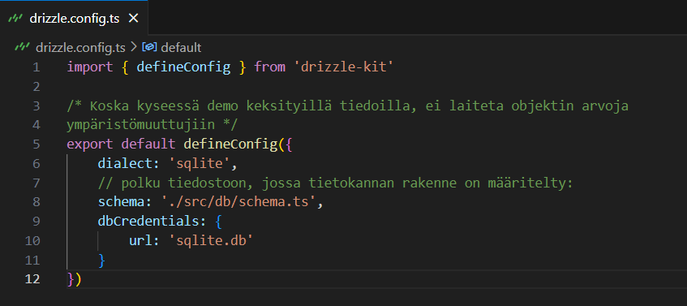
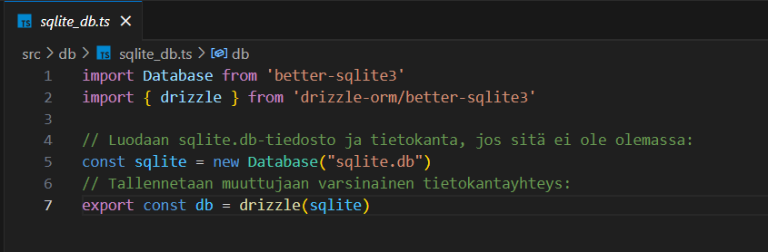
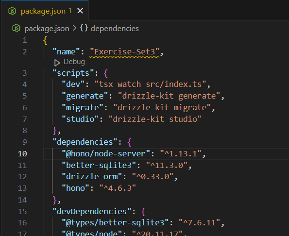
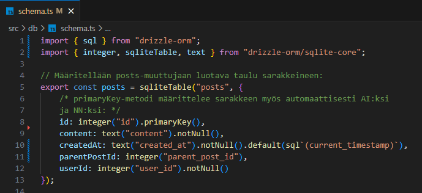
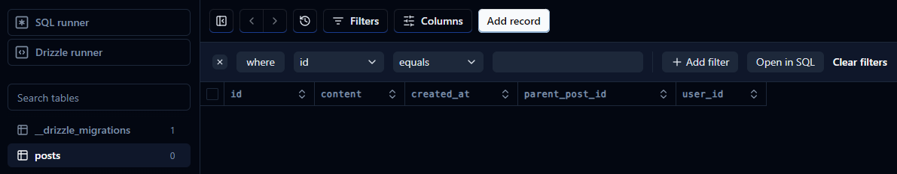
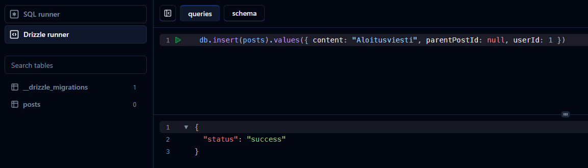
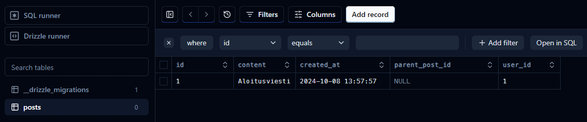
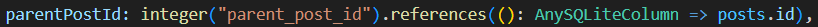
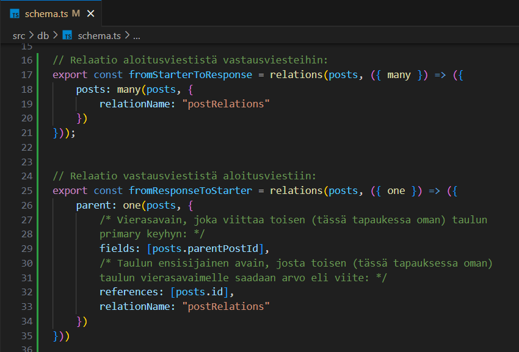

# Tehtäväsarja 3

## Esivalmistelut

Tämä tehtävä on tehty Hono-projektina npm-paketinhallintaohjelmalla. Tietokanta on toteutettu Drizzle ORM -kirjastoa hyödyntämällä. Hono-projektin juureen on luotu drizzle.config.ts-tiedosto ja db-kansio. drizzle.config.ts-tiedostossa on Drizzle ORM -kirjaston käyttöön liittyviä määrittelyjä. Konfiguraatiofunktiokutsussa määritellään muun muassa, että käytetään SQLite-tietokantaa. Lisäksi määritellään polku tiedostoon, jossa tietokannan rakenne on määritelty, sekä tietokannan tiedostonimi.

Projektin juureen on luotu myös db-kansio, jonne on tehty schema.ts- ja sqlite_db.ts-tiedostot. Valmiissa projektissa schema.ts-tiedostosta löytyy tietokantataulut ja tietokantarelaatiot, jotka on määritelty Drizzle ORM -kirjaston metodien avulla omiin muuttujiinsa. sqlite_db.ts-tiedossa Database-luokasta instantioidaan sqlite.db-niminen tietokanta ja db-muuttujaan luodaan yhteys tähän tietokantaan.

Jotta tietokannan luonti ja sen tarkastelu Drizzle Studio -työkalun avulla onnistuu, on projektin package.json-tiedostossa olevan objektin scripts-avaimessa olevan objektin sisään lisätty generate-, migrate- ja studio-avaimet arvoineen. Jos devDepedencies-avaimen objektilta ei löydy @types/better-sqlite3-avainta, pitää se lisätä erikseen komentoterminaalin kautta ajamalla projektin juurisijainnissa komento npm install @types/better-sqlite3 --save-dev.

### 1. Toteuta määrittelyn pohjalta valitsemaasi tietokantaratkaisuun tarvittavat muutokset

A) Lisätään tietokantaan posts-taulu viesteille/postauksille määritellyn datarakenteen pohjalta:

Vaatimusmäärittelyiden mukaisesti id-sarake määritellään primary keyksi primaryKey-metodin avulla. Metodi asettaa sarakkeelle automaattisesti not-null- ja auto increment -ominaisuudet. Sarake on tietotyypiltään kokonaisluku. Käyttäjältä tulevan viestin varsinaista sisältöä varten tehdäään content-sarake, jonka tietotyypiksi määritellään SQLiten tietotyypeistä text. Viestillä on oltava sisältö, joten sarake määritellään not-nulliksi. created_at-sarakkeen tietotyypiksi määritellään text, ja vaatimusmäärittelyn mukaisesti automatisoidaan aikaleiman lisääminen tietokannalle määrittelemällä sarakkeelle oletusarvo Drizzlen sql-funktion avulla. Viestillä on oltava aikaleima, joten määritellään sarake not-nulliksi. parent_post_id-sarake määritellään kokonaisluvuksi tai NULL:ksi riippuen siitä, onko tietue aloitus- vai vastausviesti. user_id-sarake määritellään kokonaisluvuksi. Koska viestillä on oltava tunnistettava lähettäjä eli käyttäjä, asetetaan sarake not-nulliksi.

Ajetaan komentoterminaalissa projektin juurisijainnissa ensin komento npm run generate, sitten npm run migrate ja lopuksi npm run studio, minkä jälkeen tietokanta posts-taululla on luotu. Projektin juuresta löytyy tämän jälkeen sqlite.db-niminen tietokanta. Luotua tietokannan taulua pääsee tarkastelemaan Drizzle Studiossa osoittessa https://local.drizzle.studio/. posts-taulusta löytyy nyt posts-muuttujaan määritellyt sarakkeet:

Suoritetaan viestin lisäävä INSERT-kysely Drizzle runnerissa:

Uusi tietue on nyt lisätty posts-tauluun. Tietokanta huolehti id:n ja aikaleiman generoinnin lisätylle tietueelle:

B) Lisätään posts-tauluun viiteavain postaukseen itseensä. 

Vaatimusmäärittelyn mukaan aloitusviestillä voi olla vastausviestejä, minkä vuoksi viestien välille tarvitaan relaatio/viite. Koska viite tehdään tauluun itseensä, tehdään tauluun sarake parent_post_id. Jos tämän sarakkeen arvo tietueella on null, kyseessä on aloitusviesti. Jos tietueelta löytyy sarakkeen kohdasta arvo, kyseessä on vastausviesti. Sarakkeen arvo on silloin toisen viestitietueen id. Näin ollen parent_post_id-sarakkeesta on määriteltävä viiteavaimeksi ja viite tehdään id-sarakkeeseen. 

Koska aloitusviestillä voi olla useita vastausviestejä mutta viestillä voi olla korkeintaan yksi "parent"-viesti, tehdään posts-taulusta one-to-many-relaatio itseensä. Määritellään relaatiot aloitusviestistä mahdollisiin vastausviesteihin ja vastausviestistä aloitusviestiin omiin muuttujiinsa.

