# Tehtäväsarja 3

## Esitiedot

Tämä tehtävä on tehty Hono-projektina npm-paketinhallintaohjelmalla. Tietokanta on toteutettu Drizzle ORM -kirjastoa hyödyntämällä. Hono-projektin juureen on luotu drizzle.config.ts-tiedosto ja db-kansio. drizzle.config.ts-tiedostossa on Drizzle ORM -kirjaston käyttöön liittyviä määrittelyjä. Konfiguraatiofunktiokutsussa määritellään muun muassa, että käytetään SQLite-tietokantaa. Lisäksi määritellään polku tiedostoon, jossa tietokannan rakenne on määritelty, sekä tietokannan tiedostonimi.

Projektin juureen on luotu myös db-kansio, jonne on tehty schema.ts- ja sqlite_db.ts-tiedostot. Valmiissa projektissa schema.ts-tiedostosta löytyy tietokantataulut ja tietokantarelaatiot, jotka on määritelty Drizzle ORM -kirjaston metodien avulla omiin muuttujiinsa. sqlite_db.ts-tiedossa Database-luokasta instantioidaan sqlite.db-niminen tietokanta ja db-muuttujaan luodaan yhteys tähän tietokantaan.

Jotta tietokannan luonti ja sen tarkastelu Drizzle Studio -työkalun avulla onnistuu, on projektin package.json-tiedostossa olevan objektin scripts-avaimessa olevan objektin sisään lisätty generate-, migrate- ja studio-avaimet arvoineen. Jos devDepedencies-avaimen objektilta ei löydy @types/better-sqlite3-avainta, pitää se lisätä erikseen komentoterminaalin kautta ajamalla projektin juurisijainnissa komento npm install @types/better-sqlite3 --save-dev.

## Toteutus
### 1. Toteuta määrittelyn pohjalta valitsemaasi tietokantaratkaisuun tarvittavat muutokset

A) Lisätään tietokantaan posts-taulu viesteille/postauksille määritellyn datarakenteen pohjalta:

Vaatimusmäärittelyiden mukaisesti id-sarake määritellään primary keyksi primaryKey-metodin avulla. Metodi asettaa sarakkeelle automaattisesti not-null- ja auto increment -ominaisuudet. Sarake on tietotyypiltään kokonaisluku. Käyttäjältä tulevan viestin varsinaista sisältöä varten tehdäään content-sarake, jonka tietotyypiksi määritellään SQLiten tietotyypeistä text. Viestillä on oltava sisältö, joten sarake määritellään not-nulliksi. created_at-sarakkeen tietotyypiksi määritellään text, ja vaatimusmäärittelyn mukaisesti automatisoidaan aikaleiman lisääminen tietokannalle määrittelemällä sarakkeelle oletusarvo Drizzlen sql-funktion avulla. Viestillä on oltava aikaleima, joten määritellään sarake not-nulliksi. parent_post_id-sarake määritellään kokonaisluvuksi tai NULL:ksi riippuen siitä, onko tietue aloitus- vai vastausviesti. user_id-sarake määritellään kokonaisluvuksi. Koska viestillä on oltava tunnistettava lähettäjä eli käyttäjä, asetetaan sarake not-nulliksi.

Ajetaan komentoterminaalissa projektin juurisijainnissa ensin komento npm run generate, sitten npm run migrate ja lopuksi npm run studio, minkä jälkeen tietokanta posts-taululla on luotu. Projektin juuresta löytyy tämän jälkeen sqlite.db-niminen tietokanta. Luotua tietokannan taulua pääsee tarkastelemaan Drizzle Studiossa osoittessa https://local.drizzle.studio/. posts-taulusta löytyy nyt posts-muuttujaan määritellyt sarakkeet:

Suoritetaan viestin lisäävä INSERT-kysely Drizzle runnerissa:

Uusi tietue on nyt lisätty posts-tauluun. Tietokanta huolehti id:n ja aikaleiman generoinnin lisätylle tietueelle:

B) Lisätään posts-tauluun viiteavain postaukseen itseensä. 

Vaatimusmäärittelyn mukaan aloitusviestillä voi olla vastausviestejä, minkä vuoksi viestien välille tarvitaan relaatio/viite. Koska viite tehdään tauluun itseensä, on taulussa sarake parent_post_id. Jos tämän sarakkeen arvo tietueella on null, kyseessä on aloitusviesti. Jos tietueelta löytyy sarakkeen kohdasta arvo, kyseessä on vastausviesti. Sarakkeen arvo on silloin toisen viestitietueen id. Näin ollen parent_post_id-sarake on määriteltävä viiteavaimeksi, ja viite tehdään id-sarakkeeseen. 

Koska aloitusviestillä voi olla useita vastausviestejä mutta viestillä voi olla korkeintaan yksi "parent"-viesti, tehdään posts-taulusta one-to-many-relaatio itseensä. Määritellään relaatiot aloitusviestistä mahdollisiin vastausviesteihin ja vastausviestistä aloitusviestiin omiin muuttujiinsa.

C) Lisätään tauluun uusi sarake

Lisätään viestitietueille title-sarake tekstitietotyypillä. Jos halutaan, että jokaisella viestillä on otsikko, määritellään sarake posts-muuttujaan not-nulliksi. Koska taulun rakenteeseen tehtiin muutoksia, on tietokanta generoitava uudelleen. Koska tietokanta on tässä vaiheessa vasta tekeillä, poistetaan projektin juuresta drizzle-kansio sisältöineen ja sqlite.db-tiedosto. Ajetaan taulua kuvaavaan post-muuttujaan tehtyjen muutosten jälkeen projektin juuressa komennot npm run generate, npm run migrate ja npm run studio. Luomiskomennon jälkeen konsoliin tulostuu tieto, että posts-niminen taulu on luotu kuudella sarakkeella ja yhdellä vierasavaimella. Nyt myös Drizzle Studiossa näkyvään posts-tauluun on ilmestynyt relaatiot ja title-sarake:

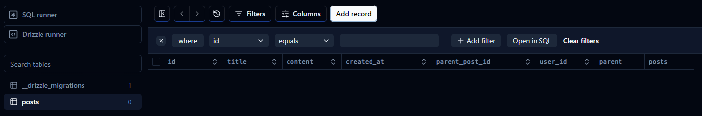

### 2. Lisää testidataa tietokantaan

A) Lisätään tietokantaan aloitusviesti

Lisätään viesti Drizzle Studiossa Drizzle runnerin kautta. Koska kyseessä on aloitusviesti, lisättävän viestin parent_post_id-sarakkeen arvo on null:

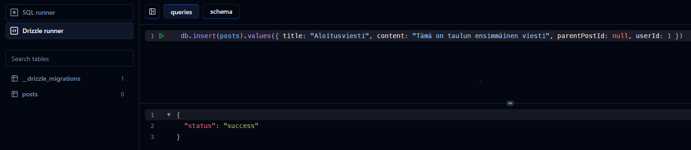

Tämän jälkeen lisätty tietue näkyy posts-taulussa:

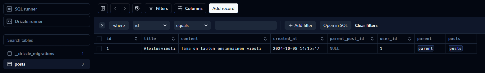

B) Lisätään tietokantaan vastausviesti

Lisätään Drizzle runnerin kautta äsken lisätylle aloitusviestille vastausviesti. Nyt lisättävän tietueen parent_post_id-sarakkeen arvon on oltava viite ensimmäisenä lisättyyn tietueeseen eli aloitusviestin id.

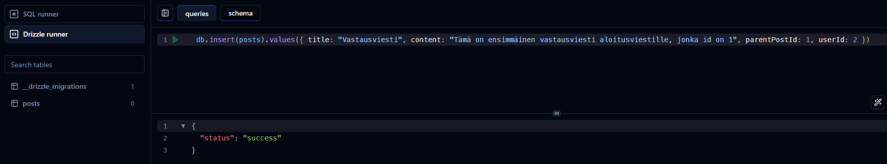

Tämän jälkeen lisätty vastausviesti näkyy posts-taulussa:

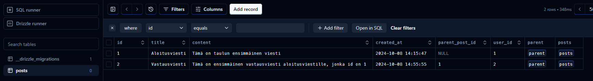

C) Aloitusviestien hakeminen tietokannasta

Lisätään tietokantaan vielä muutama aloitus- ja vastausviesti:

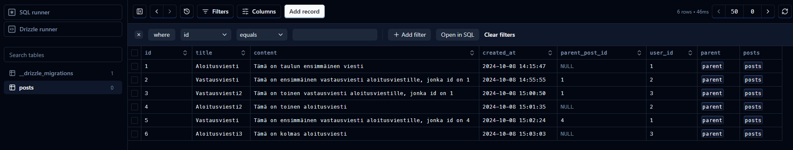

Koska jokaisen aloitusviestin parent_post_id-sarakkeen arvo on NULL, saadaan aloitusviestit haettua seuraavanlaisella kyselyllä:

>SELECT * FROM posts WHERE parent_post_id IS NULL;

Haetaan aloitusviestit nyt Drizzle runnerin kautta:

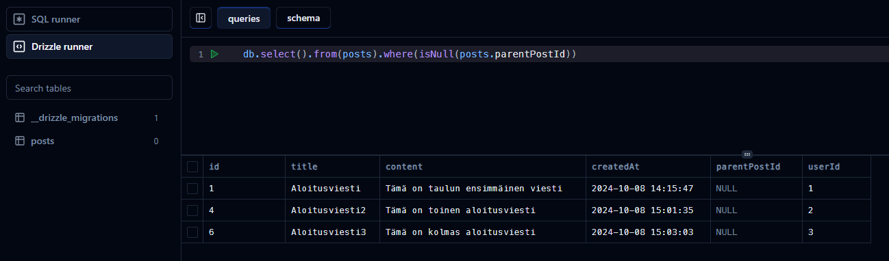

D) Aloitusviestin vastausten hakeminen yhdellä tietokantakyselyllä

Koska jokaisen aloitusviestin vastausviestin parent_post_id-sarakkeessa on sama arvo eli näiden "parent"-viestin id, saadaan tietyn aloitusviestin vastaukset haettua aloitusviestin id:n perusteella seuraavantyyppisellä kyselyllä

>SELECT * FROM posts WHERE parent_post_id = {aloitusviestin id}

Jos nyt halutaan hakea esimerkiksi ensimmäisen aloitusviestin vastausviestit, asetetaan {aloitusviestin id}-kohdan tilalle luku 1. Haetaan ensimmäisen aloitusviestin vastausviestit Drizzle runnerin kautta

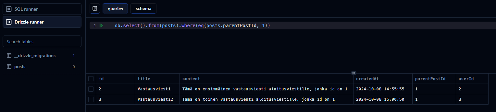

Haetaan yhdellä tietokantakyselyllä myös sekä aloitusviesti että sen vastausviestit liittämällä kyselyyn OR-vertailu:

>SELECT * FROM posts WHERE parent_post_id = 1 OR id = 1;

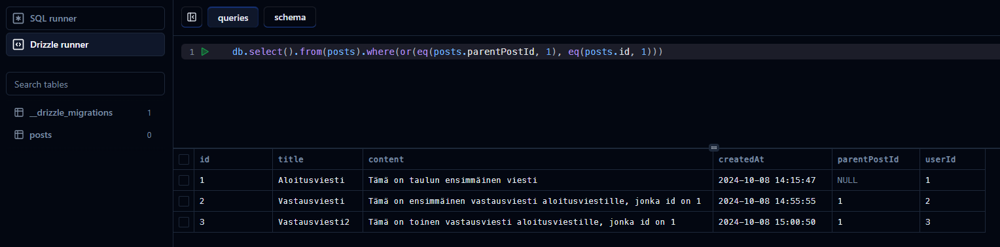

E) Aloitusviestin poistamisen ongelma, kun sille on olemassa vastauksia

Jos jonkin vastausviestin "parent"-viesti koitetaan poistaa, ei se onnistu, koska relaatioilla on oletuksena no action -toiminto. Silloin tietuetta, josta on vierasavainviite toiseen tietueeseen, ei voida poistaa, jottei vierasavaimellinen tietue jää orvoksi. 

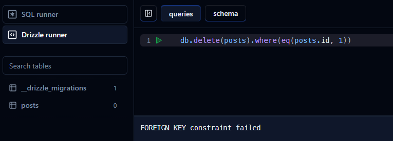

Vaatimusmäärittelyn mukaan vastausviestit on poistettava, kun näiden "parent"- eli aloitusviesti poistetaan. Määritellään siksi vierasavaintoiminnoksi no action -toiminnon sijaan cascade-toiminto sekä muokkaaville että poistaville kyselyille. Toiminto huolehtii siitä, että tietueet, joissa on viiteavain poistettavasta tietueesta, poistetaan, eikä tauluun jää orpoja tietueita. Vastaavasti tietueiden viiteavaimet päivittyvät, jos niiden "parent"-tietueen primary keyn arvo päivittyy, jolloin tauluun ei jää tietueita vanhalla viitteellä. 

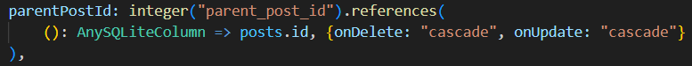

Generoidaan ja migroidaan tietokanta, jotta vierasavaintoimintoon liittyvä muutos saadaan voimaan. Käynnistetään sen jälkeen Drizzle Studio. Huolehditaan, että aiemmin lisätyt tietueet ovat tietokannassa. Suoritetaan sitten ensimmäisen aloitusviestin poistava kysely, joka tällä kertaa onnistuu.

Huomataan, ettei posts-taulussa ole aloitusviestin poistamisen jälkeen myöskään viestin vastaustietueita.

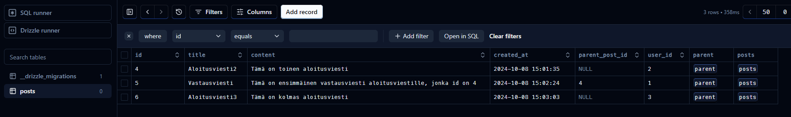

### 3. Lisäominaisuuden suunnitteleminen ja määritteleminen

A) Suunnitellun lisäominaisuuden kuvaus

Käyttäjien on mahdollista antaa tykkäys mihin tahansa keskustelupalstan viestiin.

B) Vaatimusmäärittely

- Viesteissä ei oletusarvoisesti ole tykkäyksiä
- Kuka tahansa käyttäjä voi tykätä mistä tahansa viestistä
- Yksi käyttäjä voi tykätä viestistä samanaikaisesti vain kerran
- Käyttäjä voi poistaa tykkäyksensä mistä tahansa viestistä
- Kun viestiä tarkastellaan, siinä olevien tykkäysten lukumäärä on käyttäjälle näkyvissä

C) Muutosten kuvaileminen keskustelupalstan datarakenteeseen 

Koska yksi käyttäjä voi antaa tykkäyksen monelle viestille ja yhdellä viestillä voi olla monen eri käyttäjän tykkäys, on viestin ja käyttäjän välillä many-to-many-yhteys. Luodaan tykkäyksiä kuvavastavalle yhteydelle siis välitaulu, jonka nimi voisi olla esimerkiksi likes. Taulun primary key on komposiittiavain, joka muodostuu viiteavaimista posts- ja users-tauluihin. likes-taululla on siis kaksi saraketta: user_id ja post_id, jotka kumpikin ovat viiteavaimia. 

Kun käyttäjä tykkää viestistä, likes-tauluun lisätään esimerkiksi web-ohjelmointirajapintafunktion kautta tietue, jossa on tykätyn viestitietueen id sekä tykkäyksen antaneen käyttäjän id. Koska primary keyn on oltava ainutlaatuinen (Yasar 2022), voi yhdellä käyttäjällä yhtä viestiä kohtaan olla likes-taulussa ainoastaan yksi tietue. Näin ollen taulun rakenne hoitaa sen, että yksittäinen käyttäjä voi tykätä yksittäisestä viestistä samanaikaisesti vain kerran. Jos käyttäjä poistaa tykkäyksensä viestistä, rajapintafunktion kautta likes-taulusta poistetaan tietue, jonka user_id vastaa tykkäyksen poistavaa käyttäjää ja post_id viestiä, josta käyttäjä poistaa tykkäyksensä.

Vaatimusmäärittelyn mukaisille viestikohtaisille tykkäysmäärille ei tässä ratkaisussa tehtäisi suoraan taulua tai saraketta olemassa oleviin tauluihin. Sen sijaan kunkin viestin tykkäyslukumäärien hakeminen voitaisiin liittää esimerkiksi rajapintakyselyyn, joka hakee viestin tiedot. Viestin tiedot hakevaan rajapintakyselyyn voitaisiin siis sisällyttää toinen seuraavanlainen tykkäysten lukumäärän hakeva SELECT-kysely:

>SELECT COUNT(user_id) AS like_count FROM likes WHERE post_id = {haettavan viestin id};

Mikäli koostefunktioihin liittyvät käytänteet sallivat, voitaisiin yllä oleva SELECT-kysely vaihtoehtoisesti sisällyttää viestin tiedot hakevaan SELECT-kyselyyn kyselyliitoksella. Varsinaisesta rajapintafunktiosta palautettaisiin lopuksi esimerkiksi viestin tiedot sisältävä JSON-objekti, jonka yhtenä avaimena olisi "likeCount" haetulla arvolla.

### Lähteet

Yasar, K. 2022. primary key (primary keyword). Viitattu 9.10.2024 https://www.techtarget.com/searchdatamanagement/definition/primary-key

